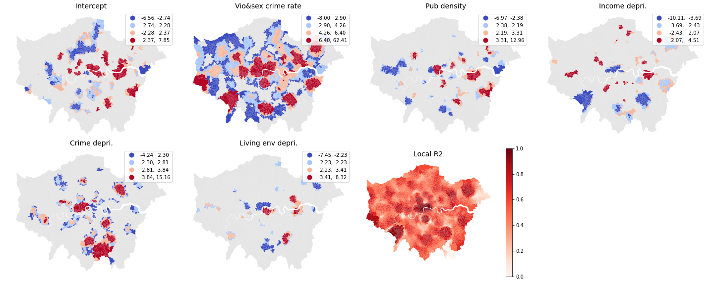

# Spatial Analysis of Drug Crimes in London

## Project description
This project studied how the spatial distribution of drug crime is associated with violent and sexual crime, pub density, and several socioeconomic factors in London. These socioeconomic factors (income deprivation, crime deprivation, living environment deprivation) are selected from the IMD index. Kernel density estimation is used to compare the distribution of drug crimes, violent and sexual crimes, and pub locations.  

We found that the hotspots of drug crimes and violent and sexual crimes shares some similarity. Global OLS regression and geographically weighted regression are implemented to study the association between drug crime rate and other factors. Based on the results of Moran’s I and LISA, this project confirmed that spatial autocorrelation exists among the distribution of drug crime rate. Further the GWR model indeed achieved a better result than the OLS model. From the result of the GWR model we can conclude that drug crime rate has a strong association with violent and sexual crime rate in many local regions. All factors showed statistically significant associations around central London. Crime deprivation showed a strong association in more local areas than pub density, income deprivation, and living environment deprivation.
## Datasets
- [London Crime data in 2021][1]
- [Population data in the UK][2]
- [Pubs in London][3]
- [Index of Multiple Deprivation 2019][4]

## preprocessing.ipnyb
Includes data preprocess and kernel density estimation

## regression.ipynb
Includes OLS, Moran's I, GWR

## Author
R Jiang

[1]:https://data.police.uk/data/
[2]:https://www.ons.gov.uk/peoplepopulationandcommunity/populationandmigration/populationestimates/datasets/populationestimatesforukenglandandwalesscotlandandnorthernireland  
[3]:https://data.london.gov.uk/dataset/cultural-infrastructure-map
[4]:https://www.gov.uk/government/statistics/english-indices-of-deprivation-2019
